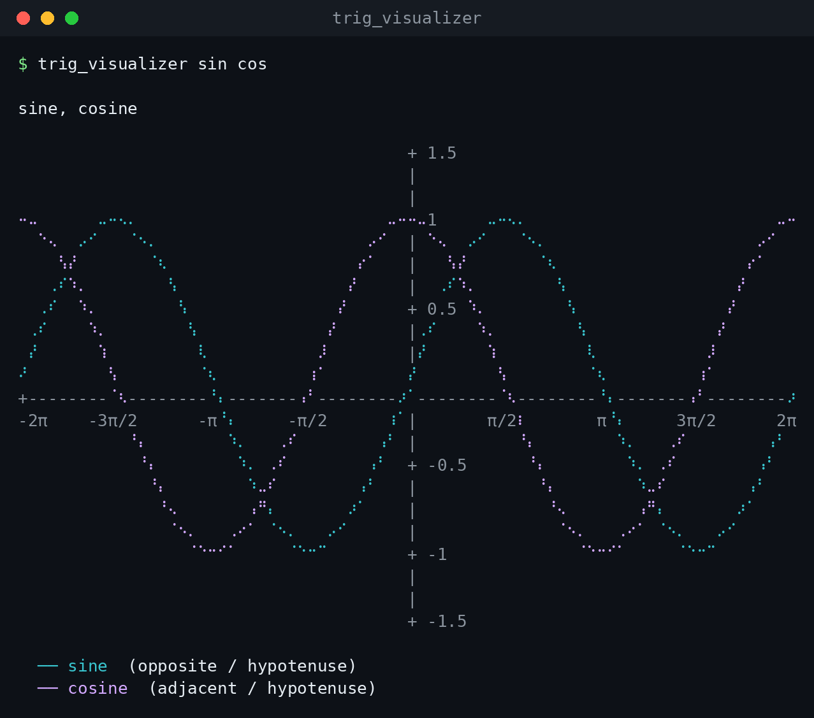
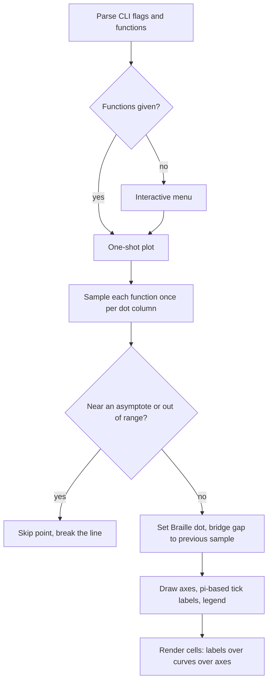

# Trigonometric Function Visualizer

A fast, dependency-free C++ tool that plots sine, cosine, tangent, cosecant, secant, and cotangent right in your terminal — with smooth Unicode Braille curves, ANSI colors, π-based axis labels, function overlays, and `A·f(Bx + C) + D` transforms.



The screenshot above is real program output (`trig_visualizer sin cos`), rendered by [`assets/generate_screenshot.py`](assets/generate_screenshot.py).

## Features

- **Braille sub-cell rendering** — each character cell holds a 2×4 dot grid, giving 8× the resolution of classic ASCII plots. `--ascii` falls back to plain `' . :` characters for terminals without Unicode.
- **Overlays** — plot any combination of the six functions on one set of axes, each in its own ANSI color with a legend (`trig_visualizer sin cos tan`).
- **π-based axis labels** — x ticks land on clean multiples of π (`-π`, `π/2`, `3π/4`, …) instead of raw decimals.
- **Transforms** — plot `A·f(Bx + C) + D` with `--amplitude`, `--frequency`, `--phase`, and `--offset`.
- **Custom ranges** — `--xmin`/`--xmax`/`--ymax` accept π expressions like `-pi/2`, `3pi/4`, or `2pi`.
- **Asymptote-aware** — points at a division by zero are skipped, curve segments are never bridged across a jump discontinuity, and reciprocal functions are clamped so a spike near an asymptote doesn't dwarf the plot.
- **Connected curves** — samples are joined vertically so steep curves read as lines, not scattered dots.
- **Two modes** — pass functions on the command line for one-shot output (pipe-friendly; color auto-disables when piped), or run with no arguments for an interactive menu.
- **No dependencies** — just the C++17 standard library. Builds on Linux, macOS, and Windows.


## Getting started

### Requirements

- A C++17-capable compiler (g++, clang++, or MSVC)
- Optionally, [CMake](https://cmake.org/) 3.10+

### Build with CMake

```bash
cmake -B build -DCMAKE_BUILD_TYPE=Release
cmake --build build
./build/trig_visualizer
```

### Build with g++ directly

```bash
g++ -std=c++17 -O2 src/main.cpp -o trig_visualizer
./trig_visualizer
```

### Run the tests

```bash
ctest --test-dir build --output-on-failure
```

## Usage

### One-shot mode

```bash
trig_visualizer [options] [function ...]
```

Functions can be given as names (`sin`, `cosine`, `cot`, …) or menu keys (`s`, `c`, `t`, `C`, `S`, `T`), and several can be combined into one plot. Angle-valued options accept π expressions: `pi`, `-pi/2`, `3pi/4`, `2pi`, or plain numbers.

| Option | Meaning | Default |
|---|---|---|
| `--xmin=V`, `--xmax=V` | x range | `-2pi` .. `2pi` |
| `--ymax=V` | y range is `[-V, V]` | auto |
| `--width=N`, `--height=N` | plot size in characters | 90 × 28 |
| `-a`, `--amplitude=V` | plot `V·f(x)` | 1 |
| `-f`, `--frequency=V` | plot `f(V·x)` | 1 |
| `-p`, `--phase=V` | plot `f(x + V)` | 0 |
| `-o`, `--offset=V` | plot `f(x) + V` | 0 |
| `--ascii` | plain ASCII output instead of Braille | off |
| `--no-color` / `--color` | force colors off / on | auto |
| `-h`, `--help` | show help | |
| `--version` | show version | |

Examples:

```bash
trig_visualizer sin cos                    # overlay sine and cosine
trig_visualizer tan --ymax=6               # tangent with a taller y range
trig_visualizer sin -a 2 -f 2              # plot 2·sin(2x)
trig_visualizer sin --xmin=-pi --xmax=pi   # one period, centered
trig_visualizer all --ascii --no-color     # all six functions, plain ASCII
```

### Interactive mode

Run with no functions to get a menu:

| Key | Function  | Ratio                  |
|-----|-----------|------------------------|
| `s` | sine      | opposite / hypotenuse  |
| `c` | cosine    | adjacent / hypotenuse  |
| `t` | tangent   | opposite / adjacent    |
| `C` | cosecant  | hypotenuse / opposite  |
| `S` | secant    | hypotenuse / adjacent  |
| `T` | cotangent | adjacent / opposite    |
| `a` | all six at once | —                |
| `h` | help      | —                      |
| `q` | quit      | —                      |

Enter several functions at once (`sc`, `sin cos`, `s C`) to overlay them. Any size/range/transform flags given on the command line apply to every plot drawn in the session.

## How it works


```mermaid
flowchart TD
    A[Parse CLI flags and functions] --> B{Functions given?}
    B -->|yes| C[One-shot plot]
    B -->|no| M[Interactive menu] --> C
    C --> D[Sample each function once per dot column]
    D --> E{Near an asymptote or out of range?}
    E -->|yes| F[Skip point, break the line]
    E -->|no| G[Set Braille dot, bridge gap to previous sample]
    G --> H[Draw axes, pi-based tick labels, legend]
    H --> I[Render cells: labels over curves over axes]
```

The canvas is a grid of character cells, each holding a 2×4 Braille dot matrix (`U+2800`–`U+28FF`), a text overlay (axes and labels), and a color. Curves are sampled once per dot column and adjacent samples are connected vertically — except across jump discontinuities, which are detected by the size of the jump relative to the y range. Asymptotes are caught by checking the underlying denominator (`cos` for tan/sec, `sin` for csc/cot) before dividing.

## Project structure

```
.
├── src/
│   ├── main.cpp          # CLI parsing + interactive menu
│   ├── plotter.hpp       # axes, ticks, curves, legend
│   ├── canvas.hpp        # Braille/ASCII cell canvas with ANSI color
│   ├── trig.hpp          # the six functions, transforms, safe evaluation
│   └── parse.hpp         # pi-expression parsing, label formatting
├── tests/
│   └── tests.cpp         # unit tests (run via ctest)
├── .github/workflows/
│   └── ci.yml            # build + test on Linux, macOS, Windows
├── assets/
│   ├── generate_screenshot.py    # renders the README terminal screenshot
│   ├── generate_diagrams.py      # regenerates the matplotlib diagrams
│   ├── terminal_demo.png
│   ├── functions_overview.png
│   └── unit_circle.png
├── CMakeLists.txt
├── LICENSE
└── README.md
```

## Regenerating the images

All README images are checked into `assets/` so they render on GitHub without extra tooling.


The terminal screenshot is generated from real program output; the reference diagrams are drawn with matplotlib:

```bash
# terminal screenshot (build the project first)
pip install Pillow
python assets/generate_screenshot.py build/trig_visualizer

# matplotlib reference diagrams
pip install matplotlib numpy
python assets/generate_diagrams.py
```

## License

This project is licensed under the MIT License — see [LICENSE](LICENSE) for details.
